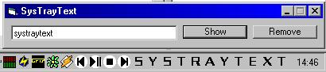



## SysTrayText

### Description

display a text in the system tray (you know, next to the clock). has auto-scrolling for large texts.

[update]found a little bug in the first code, its ok now[/update]

for those who think its useless, i'm currently working on some usefull things to use it for (displaying system status etc)
 
### More Info
 

             |
---                |---
**Submitted On**   |2001-05-11 15:00:20
**By**             |[BIG BAD BOOTZ](https://github.com/Planet-Source-Code/PSCIndex/blob/master/ByAuthor/big-bad-bootz.md)
**Level**          |Intermediate
**User Rating**    |4.8 (29 globes from 6 users)
**Compatibility**  |VB 5\.0, VB 6\.0
**Category**       |[Windows API Call/ Explanation](https://github.com/Planet-Source-Code/PSCIndex/blob/master/ByCategory/windows-api-call-explanation__1-39.md)
**World**          |[Visual Basic](https://github.com/Planet-Source-Code/PSCIndex/blob/master/ByWorld/visual-basic.md)
**Archive File**   |[SysTrayTex195035112001\.zip](https://github.com/Planet-Source-Code/big-bad-bootz-systraytext__1-23111/archive/master.zip)

